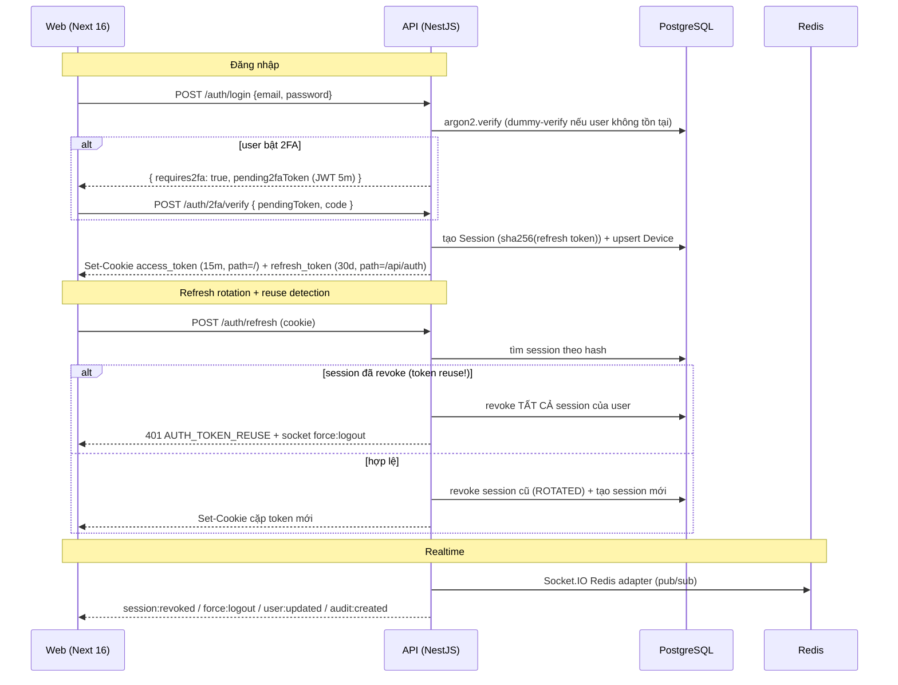

# Forge — Monorepo Template (Auth / RBAC / Realtime)

Template production-grade: **NestJS 11** (API) + **Next.js 16** (Web) + **Prisma 7 / PostgreSQL** + **Redis** + **Socket.IO**, quản lý bằng **pnpm workspace**.

| Thành phần | Công nghệ |
|---|---|
| `apps/api` | NestJS 11, Prisma 7 (driver adapter), BullMQ, Socket.IO (Redis adapter), argon2, otplib v13, winston |
| `apps/web` | Next.js 16 (App Router, `proxy.ts`), shadcn/ui (Tailwind v4), react-query v5, zustand, react-hook-form |
| `packages/shared` | Zod v4 — **source of truth** cho mọi schema/type/constant dùng chung FE-BE |

## Tính năng

- **Auth**: đăng ký + OTP email, đăng nhập, **2FA TOTP** (QR + 8 recovery codes), **Google OAuth** (authorization code flow thủ công, state chống CSRF qua Redis), quên/đổi mật khẩu.
- **Token**: access JWT 15 phút + refresh token 30 ngày (lưu **sha256 hash** trong DB), **rotation + reuse detection** (token bị dùng lại → revoke toàn bộ phiên + force logout realtime). Cookie httpOnly/Secure/SameSite=Lax.
- **RBAC**: permission dạng `resource:action`, guard đọc cache Redis TTL 60s, **invalidate tức thì** khi đổi role/permission + emit socket để FE refetch.
- **Sessions/Devices**: danh sách phiên theo thiết bị, revoke từng phiên / tất cả, thiết bị bị revoke **logout realtime**, cron dọn phiên hết hạn.
- **Audit log**: interceptor tự ghi mọi mutation (`@Audit('user.update')` + diff từ service qua AsyncLocalStorage), redact `password|token|secret|otp`, ghi qua BullMQ, admin xem **realtime** với virtual scroll + cursor pagination.
- **Bảo mật nâng cao**: trusted device 30 ngày (skip 2FA, cookie + hash trong DB), email cảnh báo đăng nhập từ thiết bị lạ, account lockout theo email (10 lần sai/15 phút — chống brute-force phân tán).
- **Invitation**: admin mời user qua email (link đặt mật khẩu 7 ngày, dùng 1 lần, auto-login sau kích hoạt).
- **Vận hành**: Bull Board tại `/api/admin/queues` (cần `audit:read`), healthcheck ping DB+Redis, CI GitHub Actions (lint/typecheck/test/e2e/docker).

## Setup từ zero

Yêu cầu: Node ≥ 22, pnpm 11 (corepack), Docker.

```bash
cp .env.example .env          # rồi sửa: JWT secrets, TOTP_ENCRYPTION_KEY (openssl rand -hex 32)
pnpm install
pnpm db:up                    # Postgres 17 + Redis 7 (docker compose)
pnpm db:migrate init          # tạo + apply migration
pnpm db:seed                  # permissions, 3 system roles, SUPER_ADMIN từ SEED_ADMIN_*
pnpm dev                      # api: http://localhost:3001/api · web: http://localhost:3000
```

Swagger: `http://localhost:3001/api/docs`. Đăng nhập bằng `SEED_ADMIN_EMAIL` / `SEED_ADMIN_PASSWORD`.

### Lệnh thường dùng

| Việc | Lệnh |
|---|---|
| Dev cả 2 app (kèm watch shared) | `pnpm dev` |
| Chỉ API / Web | `pnpm dev:api` / `pnpm dev:web` |
| Migration mới | `pnpm db:migrate <ten>` |
| Seed lại (idempotent) | `pnpm db:seed` |
| Reset DB local (chặn ở prod) | `pnpm db:reset` |
| Typecheck / Lint / Test toàn repo | `pnpm typecheck` / `pnpm lint` / `pnpm test` |
| Backup / Restore DB | `pnpm db:backup` / `pnpm db:restore <file>` |
| Migrate production | `pnpm db:deploy` |

## Biến môi trường

| Biến | Mặc định | Ghi chú |
|---|---|---|
| `DATABASE_URL` | — | PostgreSQL connection string (**bắt buộc**) |
| `REDIS_HOST` / `REDIS_PORT` / `REDIS_PASSWORD` | `localhost` / `6379` / rỗng | Cache, queue, socket adapter |
| `API_PORT` / `API_GLOBAL_PREFIX` | `3001` / `api` | |
| `CORS_ORIGINS` | `http://localhost:3000` | Danh sách origin, phân tách dấu phẩy |
| `COOKIE_DOMAIN` | rỗng | Đặt khi web/api khác subdomain |
| `JWT_ACCESS_SECRET` / `JWT_REFRESH_SECRET` | — | **Bắt buộc**, ≥ 32 ký tự |
| `ACCESS_TOKEN_TTL` / `REFRESH_TOKEN_TTL` | `15m` / `30d` | Format `<số><s\|m\|h\|d>` |
| `OTP_TTL_SECONDS` | `300` | Hạn OTP email |
| `TOTP_ISSUER` | `MyApp` | Tên hiện trong app authenticator |
| `TOTP_ENCRYPTION_KEY` | — | **Bắt buộc**, 64 hex chars — mã hoá totpSecret (AES-256-GCM) |
| `MAIL_HOST` … `MAIL_FROM_ADDRESS` | rỗng | Bỏ trống `MAIL_HOST` → OTP log ra console (dev) |
| `GOOGLE_CLIENT_ID` / `GOOGLE_CLIENT_SECRET` / `GOOGLE_CALLBACK_URL` | rỗng | Bỏ trống → endpoint Google trả 503 |
| `SEED_ADMIN_EMAIL` / `SEED_ADMIN_PASSWORD` | — | Chỉ dùng bởi `pnpm db:seed` |
| `NEXT_PUBLIC_API_URL` / `NEXT_PUBLIC_WS_URL` / `NEXT_PUBLIC_APP_URL` | localhost | Nhúng vào web lúc build |

## Luồng auth



## Kiến trúc RBAC

- Permission seed từ `packages/shared/src/constants/permissions.ts` — format `resource:action`.
- `PermissionsGuard` + `@RequirePermissions(...)` đọc cache Redis `perms:{userId}` TTL 60s.
- Đổi permissions của role / gán role / đổi status → **xoá cache ngay** + emit `user:updated` → FE refetch `/auth/me`.
- Access token **không** nhúng permissions (tránh stale) — chỉ `{sub, email, sessionId}`.

## Deploy production

Stack production có sẵn **Caddy** làm reverse proxy: tự xin + gia hạn chứng chỉ Let's Encrypt, tự redirect HTTP→HTTPS, tự forward WebSocket. Mọi URL public (CORS, OAuth callback, `NEXT_PUBLIC_*`) suy ra từ **một biến `DOMAIN`**.

```bash
# 1. Trên server: clone repo, tạo .env production
#    - DOMAIN=app.example.com  (DNS đã trỏ về server)
#    - Secrets thật: JWT_*, TOTP_ENCRYPTION_KEY, REDIS_PASSWORD (bắt buộc), SEED_ADMIN_*
# 2. Deploy một lệnh:
bash scripts/deploy-prod.sh
```

Script lần lượt: build images → khởi động Postgres/Redis → chạy one-shot `migrate` (migrate deploy + seed, idempotent) → bật api/web/caddy. Deploy lại phiên bản mới = chạy lại script.

Chạy từng bước thủ công nếu cần:

```bash
docker compose -f docker-compose.prod.yml build
docker compose -f docker-compose.prod.yml up -d postgres redis
docker compose -f docker-compose.prod.yml run --rm migrate
docker compose -f docker-compose.prod.yml up -d
```

Kiến trúc network:

```
Internet ──443──> Caddy (TLS, duy nhất mở port)
                   ├─ /api/*, /socket.io/*, /health ──> api:3001 (nội bộ)
                   └─ còn lại ───────────────────────> web:3000 (nội bộ)
```

Ghi chú production:

- Cookie `Secure` tự bật theo `NODE_ENV=production` — compose đã set sẵn; truy cập bắt buộc qua HTTPS (Caddy lo) và API đã `trust proxy` để lấy đúng IP khách.
- Postgres/Redis/api/web **không mở port ra ngoài** — chỉ Caddy nghe 80/443.
- API scale ngang được: Socket.IO dùng Redis adapter, session/cache đều ở DB/Redis.
- Throttle: 300 req/phút mặc định, auth endpoints 5 req/phút/IP, refresh 20 req/phút; lockout 10 lần sai/15 phút theo email.
- Body limit 1MB, helmet bật, `x-powered-by` tắt, log rotation 10MB×3 file/service, log không bao giờ chứa body/secrets.
- Checklist trước go-live: đổi secrets dev, verify sender domain trong Brevo (`MAIL_FROM_ADDRESS`), đổi mật khẩu seeded admin, bật cron `pnpm db:backup`.

## Cấu trúc

```
apps/api          NestJS 11 — modules: auth, users, roles, permissions, sessions, audit
  src/gateways    Socket.IO gateway + Redis adapter
  src/queues      BullMQ: email (OTP), audit (ghi log)
  prisma/         schema + migrations + seed (tsx)
apps/web          Next.js 16 — App Router, src/proxy.ts chặn route theo cookie
  src/lib/api     fetch wrapper (auto-refresh single-flight) + query keys
  src/stores      zustand: auth-store (user/permissions/can), ui-store
packages/shared   zod schemas + types + constants (build CJS, dùng chung FE/BE)
scripts/db        db:up/migrate/seed/backup/restore/deploy
docker/           Dockerfile.api (pnpm deploy), Dockerfile.web (standalone)
```
